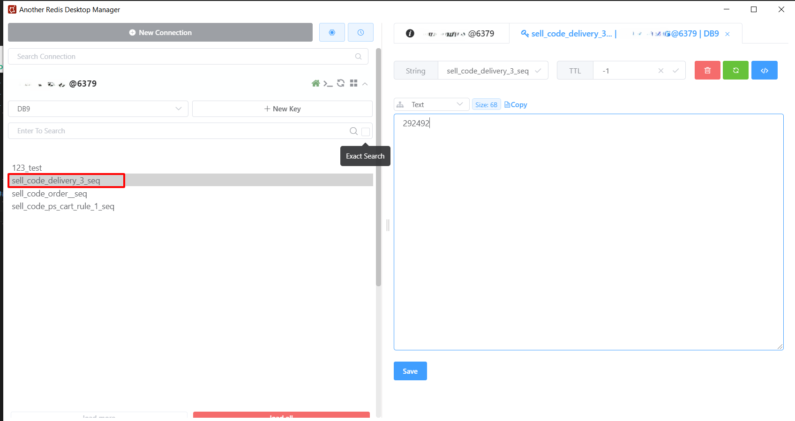

# Quét mã TO thu hồi hiển thị mã CO 3000000000

- *Nguyên nhân*: Do lỗi system sinh số CO 3000000000
- *Khắc phục*: Chưa thể khắc phục
- *Hướng xử trí*: Sinh mã CO mới duy nhất không trùng với mã trên hệ thống 
```
    1. Xin thông tin mã TO từ khách hàng.
    2. Truy cập vào db dùng TO khách hàng cung cấp tìm trên bản erp_order_cancellation.delivery_no
    3. Kiểm tra mã cancel_no (Mã CO)
    4. Generate lại mã CO mới. (Mã duy nhất không trùng trên hệ thống)
    5. Update lại Mã CO mới vào cột cancel_no
```
### Cách generate mã CO
```
    1. Dùng tool another redis truy cập vào service Redis trên ERP với địa chỉ <erp_ip>:6379
    2. Chọn DB9.
    3. Tìm key sell_code_delivery_3_seq
    4. Cập nhật dữ liệu hiện tại lên 20 đơn vị:
        Ví dụ: giá trị hiện tại: 292492 --> Cập nhật: 292512
    5. Lúc này ta có được 10 mã CO trống từ 292492 đến 292512. Các mã trong khoảng này có thể sử dụng được.
    Để tránh rủi ro nên nên lấy các mã từ 292497 đến 292512. Bỏ 5 mã đầu tiên do trong lúc cập nhật có thể có thread chạy ngầm đã dùng rồi.
    Các mã từ 292498 đến 292512 sẽ an toàn hơn
*** Lưu ý:
    - Chỉ thao khác tại thời điểm không có user thao tác trên hệ thống. 
    (Do nếu có user sử dụng giá trị sẽ thay đổi liên tục không thể xác định. Khi cập nhật lại sẽ bị sai lệch và xảy ra trường hợp trùng mã TO làm crash hệ thống).
    - Giá trị chỉ được phép tăng không được phép giảm.
    5. Chọn save để cập nhật lại giá trị.
```

